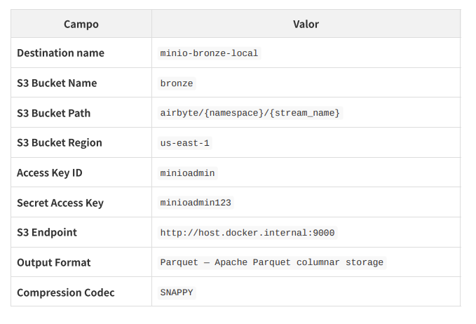

## Instalação no Windows ##
Instalar o abctl.exe a partir do seguinte endereço:

[Airbyte](https://docs.airbyte.com/platform/using-airbyte/getting-started/oss-quickstart)

Instalação como usuário não privilegiado:

Após fazer o download, extrair o arquivo.

Dentro da pasta que será criada, localize o arquivo abctl.exe.

Crie uma pasta airbyte em:

C:\Users\{seu_usuario}\AppData\Local\airbyte

Copie o arquivo abctl.exe para essa pasta.

Edite a sua variável de ambiente PATH e inclua o caminho: 

C:\Users\{seu_usuario}\AppData\Local\airbyte

Após terminar a instalação, configurar seu usuário e senha:

abctl local credentials --email SeuEmail --password SuaSenhaSegura

Se você quiser alterar sua senha, posteriormente:

abctl local credentials --password SuaSenhaSegura

## A estrutura que será criada em nosso repositório ##
````
bronze/
└── restcountries_api/
└──------------ countries/
└──------------------- ano=2024/mes=01/dia=15/
└──-------------------------- countries_1705363200.parquet

````

Configuração do endpoint do airbyte:

