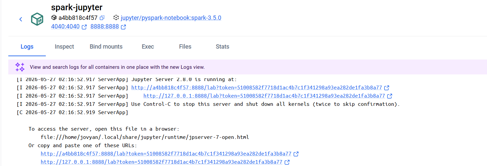

# Roteiro rápido para início das aulas

## Se você já tiver efetuado os passos das etapas anteriores e os containeres existirem:
docker compose -f docker/compose.yaml up -d

## Se você não tiver o conteúdo das aulas anteriores ou se precisar recriá-los:

Quando estiver na Mauá ou em outro ambiente controlado:

Set-ExecutionPolicy RemoteSigned -Scope CurrentUser


```ps1
git clone https://github.com/mamazzei-edu/engenharia-dados-2026.git
cd engenharia-dados-2026
git config user.name "Marco Mazzei"
git config user.email "marco.mazzei@maua.br"
python -m venv .venv
.venv/scripts/Activate.ps1
pip install -r scripts/requirements.txt
docker compose -f docker/compose.yaml up -d

```

Verifique se o minIO está funcionando acessando o endereço:

http://localhost:9000

Usuário: "minioadmin"
Senha: "minioadmin123"

Se não houver os buckets bronze, silver e gold, será necessário criá-los:


```ps1
python scripts/setup_minio.py
python scripts/ingest_pokemon.py
python scripts/ingest_countries.py
python scripts/reingerir_com_particionamento.py
```

Iniciando o jupyter notebook:

## Conectar ao servidor spark+jupyter:

Encontrar o link no docker:




Clicar no link e executar os seguintes notebooks:

parte1_formatos_arquivo_docker.ipynb

parte2a_pyspark.ipynb

parte2b_duckdb.ipynb

parte2c_iceberg.ipynb

